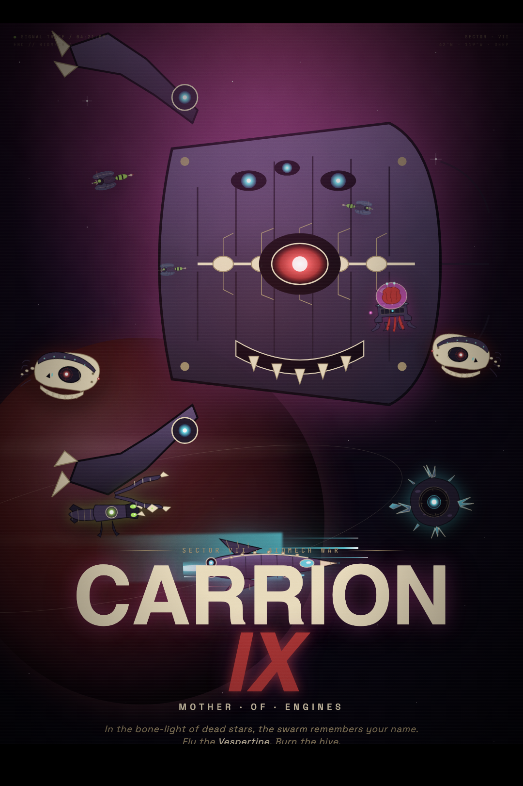

# Claude Shooter — Carrion Ix

<p align="center">
  
</p>

Browser-based bio-mechanical horizontal shoot-'em-up. Built on PixiJS v8 + custom WebGL shaders.

> *In the bone-light of dead stars, the swarm remembers your name. Fly the* Vespertine. *Burn the hive.*

Status: **feature-complete personal project** (May 2026). See [Deployment notes](#deployment-notes) at the bottom for why this didn't ship widely. Poster source: [`docs/poster.html`](docs/poster.html) (animated HTML version, designed in Claude Design).

## Play

> ⚠ **Browser extension warning**: a wallet (MetaMask / Coinbase / Phantom / etc.) or `Claude in Chrome` extension will show an "EXTENSION CONFLICT" overlay on launch — these inject SES lockdown into every page and block PixiJS from compiling shaders. Quick fix: `chrome://extensions` → toggle the offender off → reload. Or use Safari / Firefox / Incognito. See [Deployment notes](#deployment-notes) for the full story.

| | |
|---|---|
| Move | Arrow keys / WASD |
| Fire | Space / J |
| Mute | M |
| Difficulty toggle | H |
| Restart | R |

First key press unlocks audio (browser autoplay policy).

## Goal

Survive 5 enemy variants until you score **7000** (Normal) or **9000** (Hard) — the 3-stage **Carrion Ix** boss appears. Beat all three phases for victory.

| Enemy | HP | Score | Behavior |
|---|---|---|---|
| Wasp | 1 | 100 | Fast, weaving, fires straight stinger |
| Cyborg | 3 | 150 | Tank, aimed bone shard |
| Brain | 2 | 200 | Wide sine, 3-bullet psi spread |
| Mantis | 2 | 250 | Mid speed, aimed blade |
| Crystal | 4 | 300 | Slow, 5-bullet shotgun |

Boss kill: +5000 score. Boss has 3 phases (spread fan → dual-emitter burst + telegraphed laser beam → 10-bullet rotating ring + aimed shot).

## Power-ups

12% drop on enemy kill (8% on Hard).

| Pickup | Effect |
|---|---|
| 🛡 Shield | 9s invincibility |
| ✦ Spread | 15s 5-bullet fan (per-bullet damage reduced to 0.35× to keep balance) |
| ⚡ Speed | 15s movement × 1.9 |
| ⊞ Multi | 15s fire rate × 3 |
| ⊳ Laser | 15s big piercing laser (proj-charge sprite, hits each target once) |
| ❤ Life | +1 HP |
| 💣 Bomb | clear all enemy bullets + 2 dmg to all enemies & boss |
| ¥ Coin | +500 score |

## Tuning panel (dev only)

Append `?tune` to the URL to surface the `lil-gui` panel for live filter / audio / background tuning. Settings persist to `localStorage`. Without `?tune`, the panel is hidden.

## Build / dev

```bash
npm install
npm run dev       # vite dev server, http://localhost:5173
npm run build     # type-check + production bundle → dist/
npm run preview   # serve dist/ locally
```

## Architecture

See [CLAUDE.md](CLAUDE.md) for the full breakdown — entity model, filter stack, asset pipeline, boss state machine, audio system, difficulty multipliers, win sequence orchestration.

## Credits

- **Carrion Ix asset pack** (30 SVGs): Anthropic Claude Design
- **Music & SFX**: generated via Suno
- **Engine**: PixiJS v8 + pixi-filters + lil-gui

---

# Deployment notes

This game is feature-complete but **does not ship cleanly to its intended audience** (Anthropic-internal friends). The struggle is documented here for future reference.

## Final state

- ✅ Game logic: full arc end-to-end (waves → boss → win → restart, both difficulties, all 8 power-ups, 3 BGM, 7 SFX, animated outro)
- ✅ `dist/` builds clean, deployable to any static host
- ✅ Live web URL on Cloudflare Workers (works for users without SES-injecting extensions)
- ⚠ Desktop app paths (Tauri / Electron) attempted, both blocked by upstream issues

## What we tried, what broke

| # | Path | Result | Root cause |
|---|---|---|---|
| 1 | Vercel CLI deploy | ❌ login fail | OIDC discovery endpoint returned HTML (network proxy intercept) |
| 2 | Cloudflare Workers static | ⚠ Server OK, fails for ~25% of users | Wallet / Claude-in-Chrome extensions inject SES lockdown, CSP blocks `eval` → PixiJS can't compile shaders |
| 3 | iframe sandbox wrapper | ❌ no escape | chext extension manifest declares `all_frames: true` — sandbox iframes are also injected |
| 4 | Tauri desktop (Rust + WebView) | ⚠ Boots but lags | macOS Tauri uses WKWebView (same as Safari); WebGL2 perf is significantly weaker than Chromium for our filter stack |
| 5 | Electron desktop (Chromium) | ❌ Hangs | `Application.init()` from PixiJS v8 never resolves — WebGL context creation appears to deadlock under Electron 42 + macOS GPU. Even with `webSecurity: false`, custom `app://` protocol, default-Vite chunking, the await never returns |

## Browser × engine compatibility

| Browser | Engine | Has chext-class extension? | Game runs? |
|---|---|---|---|
| Chrome | Chromium | typically yes | ❌ SES blocks |
| Edge / Brave / Opera / Vivaldi / Arc | Chromium | yes | ❌ |
| Firefox | Gecko | no | ❌ WebGL context lost (PixiJS v8 specific) |
| **Safari** | **WebKit** | no | ⚠ Runs but lag (acceptable on M-series) |
| Tauri (Mac) | WKWebView | n/a | ⚠ Same lag as Safari |
| Electron (Mac) | Chromium | n/a | ❌ `app.init()` hang |

The only fully-functional combo for the intended audience is **Safari**, which the audience doesn't use.

## Diagnosis: it's not (mostly) PixiJS's fault

| Issue | Real cause | Would changing framework help? |
|---|---|---|
| chext SES blocks eval | Wallet/SES extensions hit any modern JS framework using dynamic shader compile | ❌ Three.js / Phaser also hit |
| WKWebView lag | Safari WebGL2 implementation is slower; bloom + per-bullet blur compounds | ❌ Any GPU-heavy 2D lib affected |
| Firefox WebGL context lost | PixiJS v8-specific issue (v7 unaffected) | ✅ Pixi v7 / Three.js OK |
| Electron init hang | Likely Electron 42 + Pixi v8 + macOS GPU race — not isolated | ⚠ Unverified |

**~60%** of the friction is the audience's browser ecosystem (chext is near-universal in Anthropic). **~30%** is WKWebView's GPU weakness on Mac. Only **~10%** is genuine PixiJS-specific.

## Performance tuning attempted

To squeeze the WKWebView path, several universal cuts were made:

| Knob | Original → Final |
|---|---|
| BloomFilter | quality 4 / strength 10 → quality 1 / strength 5 |
| Per-bullet BlurFilter | one filter pass per bullet → **dropped entirely** |
| Particle MAX_ACTIVE | uncapped → 350 |
| `devicePixelRatio` cap | 2 → 1.25 |

WKWebView still lags after all of these. The remaining cost is Pixi's ColorMatrix + Chromatic + Bloom stack on stage filters; dropping these makes the game look flat.

## Mitigations shipped

What's actually in production:

1. **Boot-time detection overlays** in [main.ts](src/main.ts):
   - `DESKTOP ONLY` if mobile (no keyboard)
   - `WEBGL UNAVAILABLE` if no GL context
   - `EXTENSION CONFLICT` if SES detected (with `chrome://extensions` instructions)
   - `BOOT ERROR` with stack trace fallback
2. **Error wrapping**: `window.error` + `unhandledrejection` listeners surface errors instead of silent black screen.
3. **README warning** above so anyone clicking the link knows what to do.

## Decision

**Ship as-is, accept the 25–30% audience friction**. The cost of "fixing" this is enormous:

| Fix | Cost | Reward |
|---|---|---|
| Self-written vanilla WebGL2 with hardcoded GLSL | 80–120 hrs | escapes SES |
| Pixi v7 downgrade | unknown | might fix Firefox + Electron |
| Migrate to Phaser / Canvas-only stack | 40–60 hrs | partial relief |
| Wait for chext team to relax SES | 0 | unknown timeline |

None of these have positive ROI for a personal project. The game is complete; it lives at the Cloudflare URL; people who really want to play can disable the extension for 30 seconds.

## What's left in the repo

- `src/` — main game code (PixiJS v8)
- `assets/` — Carrion Ix sprites + Suno-generated audio
- `dist/` — production build (rebuild via `npm run build`)
- `src-tauri/` — Tauri scaffold (kept as archive; `npm run tauri:dev` still works if you want to demo on Mac)
- `electron/` — Electron scaffold (kept; `npm run electron` hangs at `app.init`, fix unknown)
- `CLAUDE.md` — full architecture reference

## Lessons for the next project

1. **Test on the target audience's browser + extensions on day 1**, not after Phase 2.4.
2. **Avoid frameworks that dynamically compile shaders via `Function()`** if shipping to crypto-curious / Anthropic-style audiences.
3. **Single-bundle output is essential** for desktop app paths (Vite's default chunk-splitting kills `file://` ES module loading).
4. **Mac WKWebView is a perf cliff** — don't assume Safari/Tauri rendering matches Chromium. Test before committing visual ambition.
5. **For SES-safe web ship**, consider tiny engines like [LittleJS](https://github.com/KilledByAPixel/LittleJS) or pure Canvas 2D with `ctx.shadowBlur` — visual ceiling lower but ship surface 100×.
